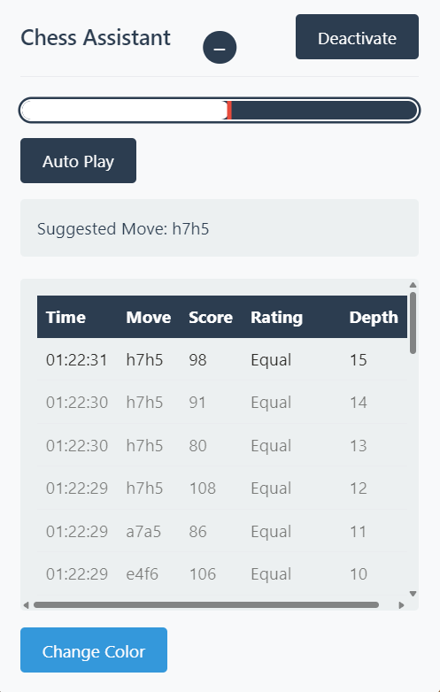

<div align="center">
  
  <h1>Chess Cheat Assistant <br><small>by Nolan Cacheux</small></h1>
  <p><b>nolancacheux/chess-cheat-assistant</b></p>
  <p><i>Chess Assistant for chess.com</i></p>
</div>


<div align="center">
  <video src="ressources/Chess Cheat Assistant.mp4" width="500" controls poster="ressources/chess-assistant.png"></video>
  <br/>
  
  
  
  
  
</div>

---

## Getting Started

1. <b>Clone the repository:</b>
   ```bash
   git clone https://github.com/nolancacheux/chess-cheat-assistant.git
   ```
2. <b>Load the extension in Chrome:</b>
   - Go to <code>chrome://extensions/</code>
   - Enable <b>Developer Mode</b>
   - Click <b>Load Unpacked</b> and select the project folder
3. <b>Go to chess.com and start a game.</b>
4. <b>Click the extension icon and activate the assistant.</b>

## Educational Purpose 

This extension is designed for <b>educational and research purposes only</b>. It helps you understand how chess engines and browser-based chess assistants work, so you can learn about move analysis, position evaluation, and the technology behind chess improvement tools. <b>Do not use this tool to cheat in online games</b>—it is meant to foster learning, awareness, and fair play. Using such tools during live games is against the rules of chess platforms and can result in bans. Please use responsibly!

---

## What is Chess Cheat Assistant?

Chess Cheat Assistant is a powerful, interactive browser extension for chess.com that demonstrates how a chess engine can analyze positions, suggest moves, and even automate play. It’s a hands-on way to explore:
- How Stockfish and other chess engines evaluate positions
- How browser extensions can interact with chess boards
- The difference between human and computer move selection
- The technical side of chess automation and move visualization

---

## Features

### Real-Time Move Analysis
As soon as you activate the assistant, it connects to the chess.com board and uses a built-in Stockfish engine to analyze the current position. You’ll see the best move, evaluation score, and analysis depth update live as the game progresses.

### Advantage Tracking
A dynamic advantage bar that visually represents which side is ahead, based on the engine’s evaluation.

### Color Selection & Board Orientation
You can choose to play as White or Black, and the assistant adapts its analysis and move suggestions accordingly. Can be useful for players who want to practice against the engine or analyze their own games.

### Full Board Analysis & Move Highlighting
The assistant overlays suggested moves directly on the chess.com board, using animated highlights and opacity changes for easy visualization.

### Auto-Play Demonstration
For demonstration and research, the assistant can automatically play the best move for you. This shows how browser automation can interact with chess boards, and how auto-play bots work.

### Analysis History & Move Quality
Every analysis is logged in a history panel, so you can review the engine’s suggestions, scores, and depths over time.

---

## How Does It Work? (Technical Overview)
- <b>Board State Extraction:</b> The extension reads the chess.com board and generates a FEN string for the current position.
- <b>Stockfish Integration:</b> A web worker runs Stockfish in the background, analyzing the position at configurable depth.
- <b>Move Highlighting:</b> The assistant overlays custom HTML/CSS highlights on the board, using animation for visibility.
- <b>Auto-Play:</b> The assistant simulates mouse events to move pieces, demonstrating browser automation techniques.
- <b>Analysis History:</b> All engine outputs are logged and displayed in a sortable, filterable table.
- <b>Advantage Bar:</b> The evaluation is mapped to a visual bar for instant feedback.


## Repository & License
- <b>Repository:</b> https://github.com/nolancacheux/chess-cheat-assistant
- <b>License:</b> MIT
- <b>Author:</b> Nolan Cacheux
